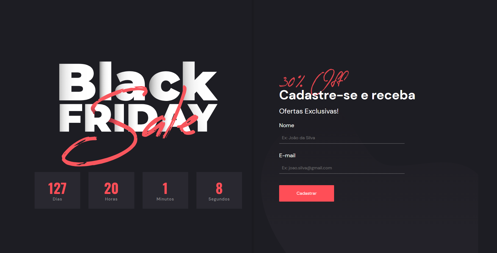

  

  &#xa0;

  <a href="https://vibrant-benz-fb1706.netlify.app/">Live preview</a>

<h1 align="center"><b>Desafio #1 Hiring Coders </b></h1>

<!-- Status -->

## :dart: Sobre ##

Este foi o primeiro desafio prático para o treinamento Hiring Coders 2021.

## :rocket: Tecnologias ##

Foram usadas as seguintes ferramentas neste projeto:

- [React](https://pt-br.reactjs.org/)
- [Styled Components](https://styled-components.com/)
- [Reack Hook Form](https://react-hook-form.com/pt/)
- [Netlify](https://www.netlify.com/) para deploy
